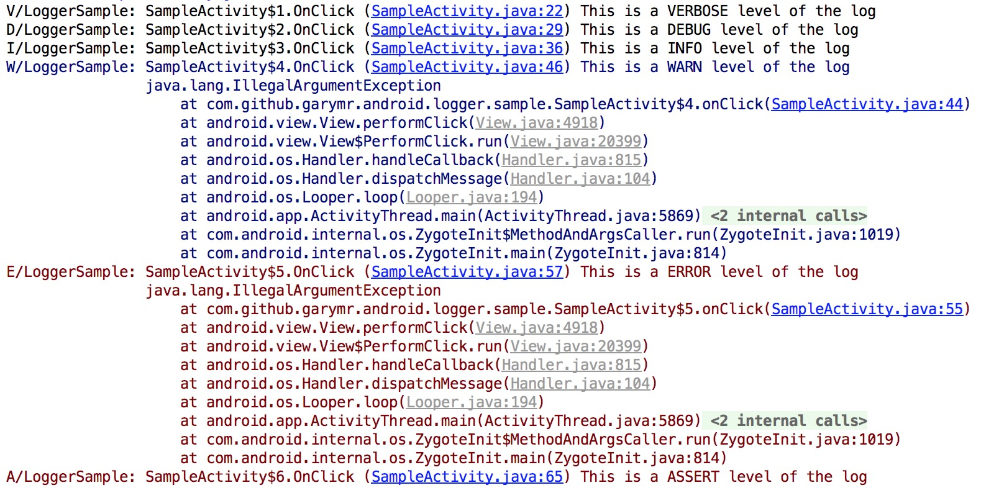
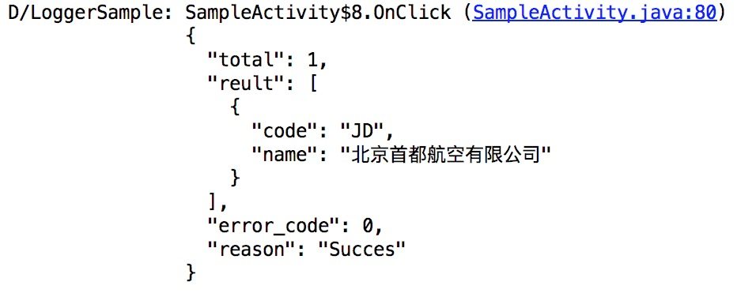

# Logger

Logger 是一个功能强大，易扩展的Android日志程序。

## 日志输出显示


## 开始使用Logger

```
Logger.v("This is a VERBOSE level of the log");
Logger.d("This is a DEBUG level of the log");
Logger.i("This is a INFO level of the log");
Logger.w(throwable, "This is a WARN level of the log");
Logger.e(throwable, "This is a ERROR level of the log");
Logger.wtf("This is a ASSERT level of the log");
```

### 支持字符串格式的参数
```
Logger.v("This is a %s level of the log", "VERBOSE");
```

### 初始化
在 Application 初始化时，或在应用调用 日志输出 之前，进行初始化：

```
Logger.initialize(
                Logger.newConfigurationBuilder()
                    .setLevel(Level.ALL) // 设置日志的输出等级
                    .setTag("LoggerSample") // 设置全局TAG
                    .create());

```

* 如果不初始化将会使用默认配置，TAG 为：LOGGER*

### 自定义日志输出

```
Logger.initialize(
                Logger.newConfigurationBuilder()
                    .setLevel(Level.ALL) // 设置日志的输出等级
                    .setTag("LoggerSample") // 设置全局TAG
                    .setLoggerPrinter(new CustomLoggerPrinter()) // 设置日志显示输出类
                    .create());

```

### 自定义日志内容
如果想附加日志信息或者修改日志输出内容可以通过设置日志内容拦截器实现。

```
Logger.initialize(
                Logger.newConfigurationBuilder()
                    .setLevel(Level.ALL) // 设置日志的输出等级
                    .setTag("LoggerSample") // 设置全局TAG
                    .setInterceptor(new CustomInterceptor()) // 设置日志内容拦截器
                    .create());

```

## 自定义当前输出TAG

```
// 自定义TAG 仅对本条输出有效
Logger.tag("LoggerSample-MYTAG").d("This is a DEBUG level of the log");
```

## 更多的日志输出类型

```
Logger.json(Level.DEBUG, json);
```



## License
* [Apache 2.0](http://www.apache.org/licenses/LICENSE-2.0.html)